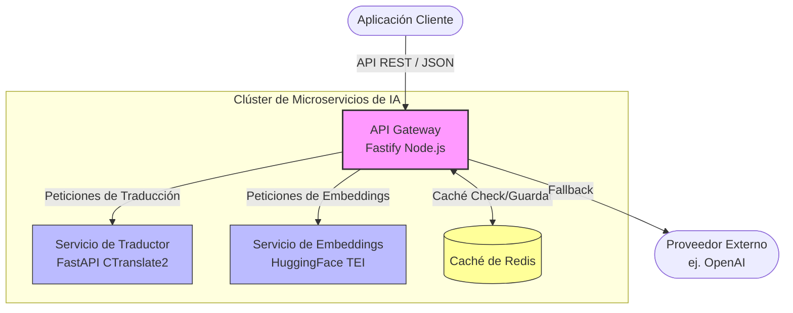
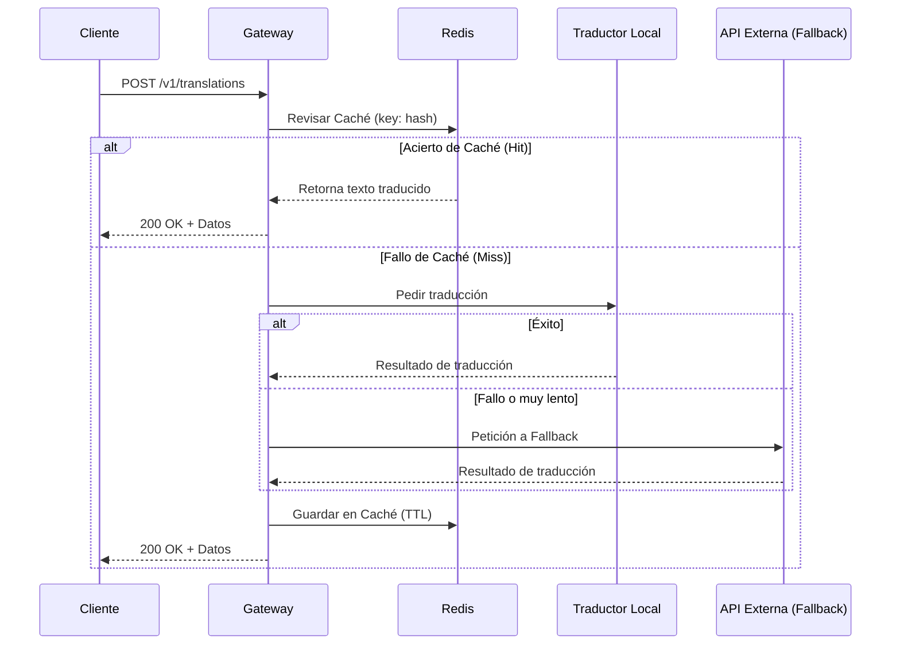

# ChambaPro AI Microservices

   

Una plataforma de orquestación de microservicios y Gateway de Inferencia de IA agnóstico y autónomo. Este servicio unifica las peticiones de IA, proporcionando endpoints compatibles con OpenAI para embeddings y endpoints especializados para traducción de idiomas con caché en Redis y mecanismos de fallback automático de local a la nube.

---

## 🏗️ Arquitectura

El sistema está construido como un clúster de microservicios orquestado por Docker, optimizando el uso de recursos separando el Gateway (I/O) de los servicios de Inferencia (CPU/GPU).



### Flujo de Peticiones (Ejemplo: Traducción)



---

## 🚀 Inicio Rápido (Desarrollo Local)

1. Clona el repositorio.
2. Copia la configuración del entorno:
   ```bash
   cp .env.example .env
   ```
3. Inicia el clúster de desarrollo:
   ```bash
   docker-compose -f docker-compose.dev.yml up --build
   ```

---

## 📚 Documentación de API e Interfaz Interactiva

El gateway sirve una **Interfaz Interactiva Personalizada** directamente en el endpoint raíz (`/`). Está construida de forma nativa con HTML/JS Vainilla y TailwindCSS para proveer una consola de pruebas rápida, sin frameworks y completamente responsiva (inspirada en la documentación de Stripe).

Una vez que el gateway esté corriendo, visita:
👉 **[http://localhost:3000/](http://localhost:3000/)**

### Características de la Interfaz Interactiva:
- **Diseño Responsivo:** Se ajusta desde lado a lado en escritorio a un diseño apilado en móvil.
- **Modo Claro/Oscuro:** Tema alternable que recuerda tu preferencia.
- **Cambio de Idioma:** Cambia instantáneamente el idioma de la interfaz entre Inglés y Español.
- **Consola de API en Vivo:** Una consola en el panel derecho en tiempo real que muestra exactamente qué JSON se enviará, y muestra la respuesta cruda del servidor.
- **Gestión de Caché:** Incluye un botón `Clear Cache` para purgar manualmente la caché de Redis durante las pruebas.

---

## 🔒 Seguridad y Endpoints

Todos los endpoints de lógica de negocio están protegidos por una API Key.
Debes incluir la cabecera `x-api-key` en todas las peticiones a `/v1/*`.

### POST `/v1/translations`
Traduce texto desde un idioma origen a un idioma destino.
- Incluye división avanzada para prevenir bucles de repetición (ej. el bug "WORK WORK WORK" de M2M100).
- Normaliza los caracteres de salto de línea literales para proteger contra pegados de texto crudo.

### POST `/v1/embeddings`
Genera vectores de embeddings utilizando HuggingFace TEI (Text Embeddings Inference).

### DELETE `/v1/cache/translations`
Limpia la caché de Redis para traducciones.
- Puedes limpiar una traducción específica pasando `?hash={hash}`.
- Sin un hash, purga todas las traducciones cacheadas.

```bash
curl -X DELETE http://localhost:3000/v1/cache/translations \
  -H "x-api-key: tu_api_key_global_aqui"
```

Configura esta llave estableciendo la variable `GLOBAL_API_KEY` en tu archivo `.env`.

---

## 📊 Observabilidad (Telemetría)

El gateway incluye soporte integrado para OpenTelemetry (OTEL) para métricas y trazabilidad.
Rastrea la tasa de peticiones, latencia, CPU/RAM del sistema, y métricas personalizadas de IA (uso de tokens, tasas de fallback).

Para activar la telemetría:
1. Establece `ENABLE_TELEMETRY=true` en tu `.env`.
2. Configura tu endpoint recolector de métricas (por defecto es un OpenTelemetry Collector local en `http://localhost:4318/v1/metrics`) usando `OTEL_EXPORTER_OTLP_ENDPOINT`.
3. Establece el nombre del servicio usando `OTEL_SERVICE_NAME` (por defecto: `chambapro-ai-gateway`).

---

## 🚢 Guía de Despliegue

La plataforma está diseñada para ser desplegada a través de Docker Compose. Puedes desplegar todo junto (monolito) o escalar cada servicio por separado.

### 🏗 Opciones de Despliegue (Archivos Compose)

Hemos dividido la infraestructura en varios archivos `docker-compose` para permitir escalar los servicios de forma independiente:

- **`docker-compose.yml` (Todo en uno)**: Despliega el Gateway, Embeddings y Translator juntos. Ideal para entornos pequeños o iniciales.
- **`docker-compose.gateway.yml`**: Despliega SOLO el servicio Gateway. Escálalo si tienes muchas peticiones concurrentes pero poco uso de IA.
- **`docker-compose.embeddings.yml`**: Despliega SOLO el motor de embeddings. Escálalo para procesos masivos de vectorización.
- **`docker-compose.translator.yml`**: Despliega SOLO el motor de traducción. Escálalo si procesas muchos idiomas simultáneamente.

A continuación se presentan las guías para las estrategias de despliegue más comunes.### 1. Easypanel (Recomendado)

[Easypanel](https://easypanel.io/) es un panel de control moderno para administrar apps de Docker. Como este repositorio contiene múltiples servicios interdependientes (Gateway, TEI, Traductor Python), debes usar el tipo de despliegue Docker Compose de Easypanel.

**Paso a paso para Easypanel:**
1. En tu panel de Easypanel, navega a tu Proyecto.
2. Haz clic en **Create Service** y selecciona la opción **Docker Compose** (NO selecciones "App").
3. Conecta tu repositorio de Github o pega el contenido de `docker-compose.yml` directamente en el editor de Compose de Easypanel.
4. Ve a la pestaña **Environment** y llena tus variables (ej. `GLOBAL_API_KEY`, `OPENAI_API_KEY`, etc).
5. Ve a la pestaña **Domains** y enlaza tu dominio público (ej., `ai.chambapro.com`) al servicio **gateway** en el puerto **3000**.
   - **NO** expongas los servicios `embeddings` ni `translator` al internet. Deben permanecer internos.
6. Haz clic en **Deploy**. Easypanel proveerá automáticamente certificados SSL y orquestará todo el clúster.

### 2. Docker Directo (VPS / EC2 / Droplet)

Si estás administrando tu propio servidor con Docker instalado:

1. Clona el repositorio en tu servidor.
2. Crea y llena tu archivo `.env` de producción basándote en `.env.example`.
3. Inicia el clúster de producción:
   ```bash
   docker-compose -f docker-compose.yml up --build -d
   ```
4. Configura un proxy inverso (como Nginx o Traefik) para enlazar un dominio al puerto `3000` y manejar la terminación SSL.

### 3. Coolify

[Coolify](https://coolify.io/) es una alternativa de código abierto y auto-hospedable a Heroku/Vercel.

1. En tu panel de Coolify, crea un nuevo **Project** y **Environment**.
2. Añade un nuevo **Resource** -> **Docker Compose**.
3. Conecta tu repositorio de Git.
4. Coolify leerá el archivo compose y detectará los servicios `gateway`, `translator` y `embeddings`.
5. En la configuración del servicio **gateway**:
   - Añade tus variables de entorno.
   - Configura los dominios/URL que quieres exponer. Coolify maneja el enrutamiento de Traefik/Caddy automáticamente.
6. Haz clic en **Deploy**.

---

## 📄 Licencia
Propietaria & Confidencial - ChambaPro
