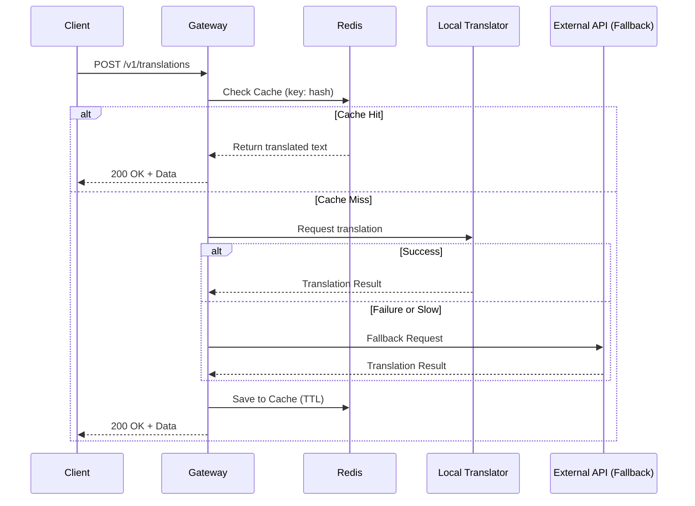

# ChambaPro AI Microservices

   

A standalone, agnostic AI Inference Gateway and Microservice orchestration platform. This service unifies AI requests, providing OpenAI-compatible endpoints for embeddings and specialized endpoints for language translation with built-in Redis caching and local-to-cloud fallback mechanisms.

---

## 🏗️ Architecture

The system is built as a microservices cluster orchestrated by Docker, optimizing resource usage by separating the I/O bound Gateway from the CPU/GPU bound Inference services.


### Request Flow (Example: Translation)



---

## 🚀 Quick Start (Local Development)

1. Clone the repository.
2. Copy the environment configuration:
   ```bash
   cp .env.example .env
   ```
3. Boot the development cluster:
   ```bash
   docker-compose -f docker-compose.dev.yml up --build
   ```

---

## 📚 API Documentation & Interactive UI

The gateway serves a **Custom Interactive UI** directly at the root (`/`) endpoint. It is built natively with Vanilla HTML/JS and TailwindCSS to provide a fast, framework-less, and responsive testing console (inspired by Stripe docs).

Once the gateway is running, visit:
👉 **[http://localhost:3000/](http://localhost:3000/)**

### Features of the Interactive UI:
- **Responsive Layout:** Adjusts from side-by-side on desktop to a stacked layout on mobile.
- **Dark/Light Mode:** Toggleable theme that remembers your preference.
- **Language Toggle:** Instantly swap the UI language between English and Spanish.
- **Live API Console:** A real-time right-hand console showing exactly what JSON will be sent, and displaying the raw JSON response from the server.
- **Cache Management:** Includes a `Clear Cache` button to manually purge the Redis translation cache during testing.

---

## 🔒 Security & Endpoints

All business logic endpoints are protected by an API Key. 
You must include the `x-api-key` header in all requests to `/v1/*`.

### POST `/v1/translations`
Translates text from a source language to a target language.
- Includes advanced chunking to prevent repetition loops (e.g. M2M100 "WORK WORK WORK" bug).
- Normalizes literal newline characters to protect against raw text pastes.

### POST `/v1/embeddings`
Generates vector embeddings using HuggingFace TEI (Text Embeddings Inference).

### DELETE `/v1/cache/translations`
Clears the Redis cache for translations. 
- You can clear a specific translation by passing `?hash={hash}`.
- Without a hash, it purges all cached translations.

```bash
curl -X DELETE http://localhost:3000/v1/cache/translations \
  -H "x-api-key: your_global_key_here"
```

Configure this key by setting the `GLOBAL_API_KEY` variable in your `.env` file.

---

## 📊 Observability (Telemetry)

The gateway includes built-in OpenTelemetry (OTEL) support for metrics and tracing. 
It tracks request rates, latency, system CPU/RAM, and custom AI metrics (token usage, fallback rates).

To enable telemetry:
1. Set `ENABLE_TELEMETRY=true` in your `.env`.
2. Configure your metric collector endpoint (default is a local OpenTelemetry Collector at `http://localhost:4318/v1/metrics`) using `OTEL_EXPORTER_OTLP_ENDPOINT`.
3. Set your service name using `OTEL_SERVICE_NAME` (default: `chambapro-ai-gateway`).

---

## 🚢 Deployment Guide

The platform is designed to be deployed entirely via Docker Compose. Below are guides for the most common deployment strategies.

### 1. Easypanel (Recommended)

[Easypanel](https://easypanel.io/) is a modern control panel for managing Docker apps. Since this repository contains multiple inter-dependent services (Gateway, TEI, Python Translator, Redis), you must use Easypanel's Docker Compose deployment type.

**Step-by-step for Easypanel:**
1. In your Easypanel dashboard, navigate to your Project.
2. Click **Create Service** and select **App**.
3. Under the **Source** tab, select **Github** and connect this repository.
4. Under the **Build** tab, **CRITICAL:** Change the Build Method to **Docker Compose**.
5. Easypanel will look for a `docker-compose.yml` in the root (ensure you create/rename your production compose file to `docker-compose.yml`).
6. Go to the **Environment** tab and populate your variables (e.g. `GLOBAL_API_KEY`, `OPENAI_API_KEY`, etc).
7. Go to the **Domains** tab and map your public domain (e.g., `ai.chambapro.com`).
   - Note: Map the domain specifically to the **gateway** service on port **3000**.
   - Do **NOT** expose the `embeddings`, `translator`, or `redis` services to the internet. They must remain internal.
8. Click **Deploy**. Easypanel will automatically provision SSL certificates and orchestrate the cluster.

### 2. Direct Docker (VPS / EC2 / Droplet)

If you are managing your own server with Docker installed:

1. Clone the repository onto your server.
2. Create and populate your production `.env` file based on `.env.example`.
3. Start the production cluster:
   ```bash
   docker-compose -f docker-compose.yml up --build -d
   ```
4. Set up a reverse proxy (like Nginx or Traefik) to map a domain to port `3000` and handle SSL termination.

### 3. Coolify

[Coolify](https://coolify.io/) is an open-source, self-hostable Heroku/Vercel alternative.

1. In your Coolify dashboard, create a new **Project** and **Environment**.
2. Add a new **Resource** -> **Docker Compose**.
3. Connect your Git repository.
4. Coolify will parse the compose file and detect the `gateway`, `translator`, `embeddings`, and `redis` services.
5. In the configuration for the **gateway** service:
   - Add your environment variables.
   - Configure the domains/URL you want to expose. Coolify handles Traefik/Caddy routing automatically.
6. Click **Deploy**.

---

## 📄 License
Proprietary & Confidential - ChambaPro
