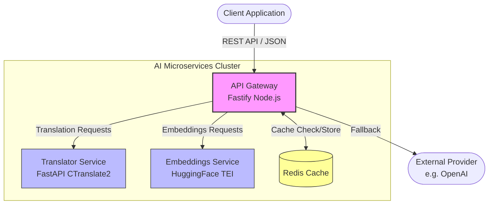
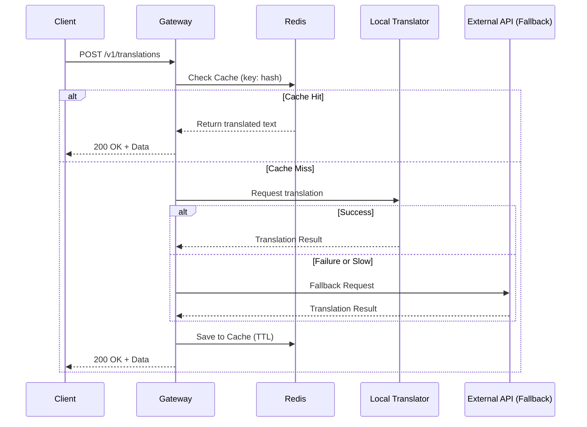

# ChambaPro AI Microservices

   

A standalone, agnostic AI Inference Gateway and Microservice orchestration platform. This service unifies AI requests, providing OpenAI-compatible endpoints for embeddings and specialized endpoints for language translation with built-in Redis caching and local-to-cloud fallback mechanisms.

---

## 🏗️ Architecture

The system is built as a microservices cluster orchestrated by Docker, optimizing resource usage by separating the I/O bound Gateway from the CPU/GPU bound Inference services.



### Request Flow (Example: Translation)



---

## 🚀 Quick Start (Local Development)

1. Clone the repository.
2. Copy the environment configuration:
   ```bash
   cp .env.example .env
   ```
3. Boot the development cluster:
   ```bash
   docker-compose -f docker-compose.dev.yml up --build
   ```

---

## 📚 API Documentation

Interactive API documentation is powered by **Scalar**, providing a modern, dark/light mode interface with built-in testing capabilities.

Once the gateway is running, visit:
👉 **[http://localhost:3000/docs](http://localhost:3000/docs)**

---

## 🔒 Security

All business logic endpoints are protected by an API Key. 
You must include the `x-api-key` header in all requests to `/v1/*`.

```bash
curl -X POST http://localhost:3000/v1/embeddings \
  -H "x-api-key: your_global_key_here" \
  -H "Content-Type: application/json" \
  -d '{"input": "Hello world"}'
```

Configure this key by setting the `GLOBAL_API_KEY` variable in your `.env` file.

---

## 📊 Observability (Telemetry)

The gateway includes built-in OpenTelemetry (OTEL) support for metrics and tracing. 
It tracks request rates, latency, system CPU/RAM, and custom AI metrics (token usage, fallback rates).

To enable telemetry:
1. Set `ENABLE_TELEMETRY=true` in your `.env`.
2. Configure your metric collector endpoint (default is a local OpenTelemetry Collector at `http://localhost:4318/v1/metrics`) using `OTEL_EXPORTER_OTLP_ENDPOINT`.
3. Set your service name using `OTEL_SERVICE_NAME` (default: `chambapro-ai-gateway`).

---

## 🚢 Deployment Guide

The platform is designed to be deployed entirely via Docker Compose. Below are guides for the most common deployment strategies.

### 1. Direct Docker (VPS / EC2 / Droplet)

If you are managing your own server with Docker installed:

1. Clone the repository onto your server.
2. Create and populate your production `.env` file based on `.env.example`.
3. Start the production cluster (using the production compose file):
   ```bash
   docker-compose up --build -d
   ```
4. Set up a reverse proxy (like Nginx or Traefik) to map a domain to port `3000` and handle SSL termination.

### 2. Easypanel

[Easypanel](https://easypanel.io/) is a modern control panel for managing Docker apps.

1. In your Easypanel dashboard, go to your Project.
2. Click **Create Service** and choose **App** (or "Docker Compose" if you prefer to paste the compose file directly).
3. We recommend using the **Docker Compose** option:
   - Paste the contents of `docker-compose.yml` into the editor.
   - Define your environment variables in the **Environment** tab.
   - In the **Domains** tab, map your public domain to the `gateway` service on port `3000`.
4. Click **Deploy**. Easypanel will automatically provision SSL certificates.

### 3. Coolify

[Coolify](https://coolify.io/) is an open-source, self-hostable Heroku/Vercel alternative.

1. In your Coolify dashboard, create a new **Project** and **Environment**.
2. Add a new **Resource** -> **Docker Compose**.
3. Connect your Git repository or paste the contents of `docker-compose.yml`.
4. Coolify will parse the compose file and detect the `gateway`, `translator`, `embeddings`, and `redis` services.
5. In the configuration for the **gateway** service:
   - Add your environment variables.
   - Configure the domains/URL you want to expose. Coolify handles Traefik/Caddy routing automatically.
6. Make sure to **not** expose the ports of `translator`, `embeddings`, or `redis` to the public internet. They should only communicate internally within the Docker network.
7. Click **Deploy**.

---

## 📄 License
Proprietary & Confidential - ChambaPro
